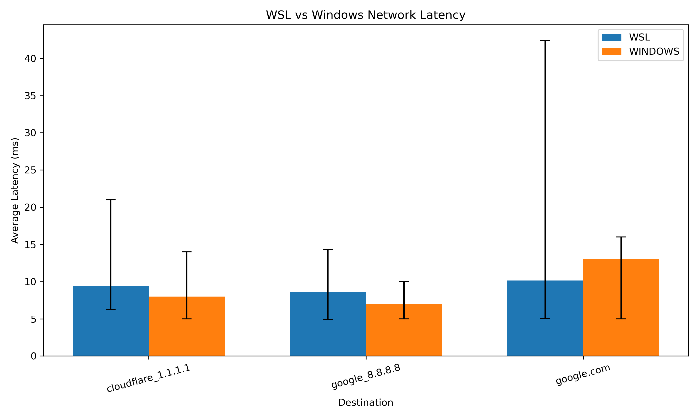

# Network Reliability Investigation

## Overview

This project investigates network performance between Windows and Windows Subsystem for Linux (WSL) on the same computer.

The goal is to determine whether measurable differences in network latency and reliability can be observed between the two environments.

The project combines Linux and Windows networking tools with Python automation and data analysis.

## Research Question

**Does the networking layer between Windows and WSL introduce measurable differences in network performance?**

The investigation compares network performance using:

* Ping latency
* Minimum and maximum latency
* Packet loss
* DNS and public network destinations
* Traceroute results
* Repeated network measurements

## Methodology

Initial network investigation was performed manually using Windows PowerShell and WSL.

The project was then expanded with Python automation to collect repeated measurements from WSL.

The automated tests measured:

* Cloudflare DNS: `1.1.1.1`
* Google DNS: `8.8.8.8`
* Google.com

Each automated WSL test round sends four ping requests to each destination.

The Windows measurements were collected using the native Windows `ping` command as a baseline comparison.

## Tools Used

* Linux / WSL
* Windows PowerShell
* Python
* Matplotlib
* Bash
* `ping`
* `nslookup`
* `traceroute`
* `ip`
* Git
* CSV data collection

## Network Configuration

The investigation identified the following network components:

* WSL virtual gateway: `172.28.96.1`
* Home network gateway: `192.168.2.1`
* WSL DNS server/proxy: `10.255.255.254`
* Windows DNS: `192.168.2.1`

## Results

### WSL vs Windows Network Latency

The automated analysis produced the following results:

| Environment | Destination          |  Average | Minimum |  Maximum | Packet Loss |
| ----------- | -------------------- | -------: | ------: | -------: | ----------: |
| WSL         | Cloudflare `1.1.1.1` |  9.41 ms | 6.22 ms | 21.00 ms |       2.50% |
| WSL         | Google DNS `8.8.8.8` |  8.62 ms | 4.88 ms | 14.35 ms |          0% |
| WSL         | Google.com           | 10.14 ms | 5.02 ms | 42.41 ms |          0% |
| Windows     | Cloudflare `1.1.1.1` |  8.00 ms | 5.00 ms | 14.00 ms |          0% |
| Windows     | Google DNS `8.8.8.8` |  7.00 ms | 5.00 ms | 10.00 ms |          0% |
| Windows     | Google.com           | 13.00 ms | 5.00 ms | 16.00 ms |          0% |

### Key Findings

* Windows had lower average latency than WSL when testing Cloudflare and Google DNS.
* WSL had lower average latency than Windows when testing Google.com.
* Both environments generally showed low latency.
* Windows recorded 0% packet loss in the baseline measurements.
* WSL recorded a packet-loss event during one Cloudflare test round.
* The WSL Cloudflare results averaged 2.50% packet loss across the stored WSL test rounds.
* WSL also showed greater latency variability for Google.com, with a maximum recorded latency of 42.41 ms.

The differences were measurable, but relatively small.

### Latency Visualization

The analysis script generates a comparison of average latency between Windows and WSL.

The error ranges show the observed minimum and maximum latency for each environment and destination.



## DNS Performance

DNS testing was also performed during the initial investigation.

WSL DNS lookups were tested using the WSL DNS configuration, while Windows used its native DNS configuration.

The DNS measurements were collected separately from the automated latency comparison and were not repeated enough to make a strong statistical comparison.

## Traceroute Findings

A traceroute from WSL to Google reached the destination in 11 hops.

The first hop was the WSL virtual gateway, followed by the home network gateway.

Some intermediate hops did not respond to traceroute probes and appeared as `* * *`. However, the traceroute continued successfully and reached Google.

The measured latency increased from approximately 1 ms near the local WSL gateway to approximately 9 ms at the destination.

## Project Structure

```text
network-reliability-investigation/
├── data/
│   ├── automated-network-tests.csv
│   ├── dns-tests.csv
│   ├── network-tests.csv
│   └── traceroute-google.txt
├── notes/
├── results/
│   └── latency_comparison.png
├── scripts/
│   ├── analyze_results.py
│   └── network_test.py
└── README.md
```

## How to Run

From the project root, run the automated network tests:

```bash
python3 scripts/network_test.py
```

Then analyze the collected data and generate the visualization:

```bash
python3 scripts/analyze_results.py
```

The network testing script automatically detects whether it is running in Windows or WSL and uses the appropriate ping command.

## Limitations

The WSL measurements contain repeated automated test rounds, while the Windows measurements currently provide a smaller baseline sample.

Because the number of measurements is not equal between the two environments, the results should be treated as an investigation rather than a definitive benchmark.

Network conditions can also change over time depending on traffic, routing, DNS behavior, and other factors.

## Conclusion

The investigation found measurable differences between Windows and WSL network performance, but the differences were relatively small.

Windows performed better for Cloudflare and Google DNS in the recorded measurements, while WSL performed better for Google.com.

The project also demonstrated that WSL can experience occasional packet loss and latency variation even when overall network performance remains stable.

The final project combines networking fundamentals, Linux, Windows PowerShell, Python automation, CSV data collection, statistical analysis, and data visualization to investigate a real networking question.
